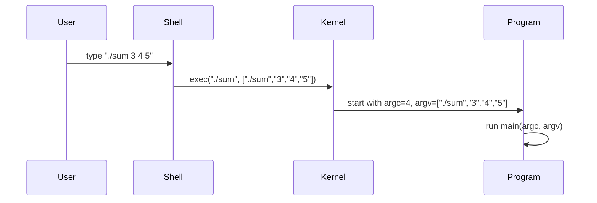

<!---
{
  "id": "5adc24d3-4054-453e-80dd-30a820be8ed3",
  "teaches": "Using `argc` and `argv` in C",
  "depends_on": ["0b6b3ce8-418e-4900-ae42-a6d068389a12"],
  "author": "Stephan Bökelmann",
  "first_used": "2025-06-26",
  "keywords": ["C", "argc", "argv", "main"]
}
--->

# Using `argc` and `argv` in C

> In this exercise you will learn how to use `argc` and `argv` to process command-line arguments in the `main` function of a C program. Furthermore we will explore how the operating system passes values to the `main` function and how to handle those values within a C program.

## Introduction

In C, the `main` function serves as the entry point of every program. Unlike other functions you might define, `main` has a special signature:

```c
int main(int argc, char *argv[])
```

Here, `argc` (argument count) tells you how many strings have been passed on the command line, and `argv` (argument vector) is an array of those strings. The operating system is responsible for gathering the command-line input, splitting it into separate tokens (according to whitespace or shell quoting rules), and then calling your program’s `main` function with those parameters. This means that the exact way arguments are parsed and handed off to your C program depends on the OS and shell environment—be it Windows CMD, PowerShell, Bash on Linux, or another command interpreter.

Understanding how `argc` and `argv` work is crucial for writing flexible programs that can take user input directly from the command line, enabling you to write utilities like file manipulators, text processors, or simple calculators without hard-coding values.

Below is a simple diagram illustrating how arguments flow from your keyboard to your C program:



By the end of this exercise, you will have created a small C program that sums integers provided via the command line, practiced inspecting `argc` for proper usage, and converted the strings in `argv` into numeric values.

### Further Readings and Other Sources

* Brian W. Kernighan and Dennis M. Ritchie, *The C Programming Language*, 2nd Edition, Prentice Hall, 1988.
* W. K. Pratt, *Introduction to the C Programming Language*, DOI:10.1007/978-3-642-16945-4\_2
* YouTube: "Command Line Arguments in C" – [https://www.youtube.com/watch?v=ZSPZob\_1TOk](https://www.youtube.com/watch?v=ZSPZob_1TOk)

## Tasks

Follow these steps to build a program named `sum.c` that computes the sum of integer arguments passed on the command line. Each step includes the code to add and an explanation you should replicate exactly.

1. **Write the initial program skeleton.**

   ```c
   #include <stdio.h>

   int main(int argc, char *argv[]) {
       return 0;
   }
   ```

   * The `#include <stdio.h>` directive allows use of `printf`.
   * `argc` and `argv` are declared but unused at this point.

2. **Check for the correct number of arguments.**

   Add the following inside `main`, before `return 0;`:

   ```c
   if (argc < 2) {
       printf("Usage: %s <list of integers>\n", argv[0]);
       return 1;
   }
   ```

   * `argc < 2` means no integers were provided (only the program name).
   * `argv[0]` is the program’s name as invoked.

3. **Initialize a sum variable.**

   Just after the argument check, declare and initialize:

   ```c
   int sum = 0;
   ```

   * `sum` will accumulate the total of all integers.

4. **Loop through the arguments and convert to integers.**

   Below the initialization, add:

   ```c
   #include <stdlib.h>  // for atoi

   for (int i = 1; i < argc; i++) {
       int value = atoi(argv[i]);
       sum += value;
   }
   ```

   * `atoi` takes a string like `"42"` and returns the integer `42`.
   * Internally, for `"42"`:

     * `'4' - '0'` → 4
     * `'2' - '0'` → 2
     * `result = 4 * 10 + 2 = 42`

5. **Print the computed sum.**

   Still inside `main`, after the loop, insert:

   ```c
   printf("Sum of arguments: %d\n", sum);
   ```

   * This outputs the final total.

6. **Full program listing.**

   Combine all parts into `sum.c`:

   ```c
   #include <stdio.h>
   #include <stdlib.h>

   int main(int argc, char *argv[]) {
       if (argc < 2) {
           printf("Usage: %s <list of integers>\n", argv[0]);
           return 1;
       }

       int sum = 0;
       for (int i = 1; i < argc; i++) {
           int value = atoi(argv[i]);
           sum += value;
       }

       printf("Sum of arguments: %d\n", sum);
       return 0;
   }
   ```

7. **Compile and run your program.**

   ```bash
   gcc -o sum sum.c
   ./sum 10 20 30
   ```

   Expected output:

   ```text
   Sum of arguments: 60
   ```

## Advice

As you work through this exercise, it helps to edit your code incrementally in `vim`, compiling and running after each change to catch errors early. Reflect on how `argc` and `argv` mirror parameters in ordinary functions yet differ because the operating system orchestrates their values. If you find yourself needing more practice with functions in C, revisit the previous sheet on function definitions and calls [Functions in C](./functions.md). Tackling small programs like this one builds your confidence: next time you’ll smoothly handle more complex parsing tasks, such as flags or configuration files. Good luck, and remember that each mistake you debug deepens your understanding of how C interacts with the system under the hood.
